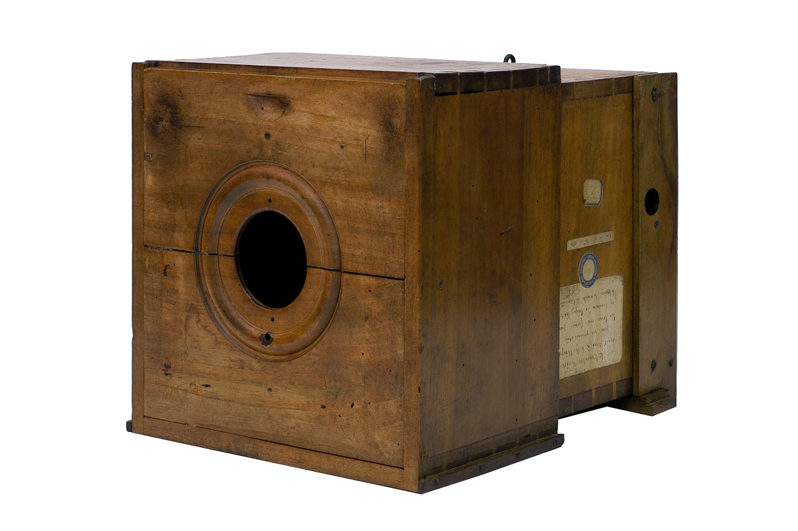
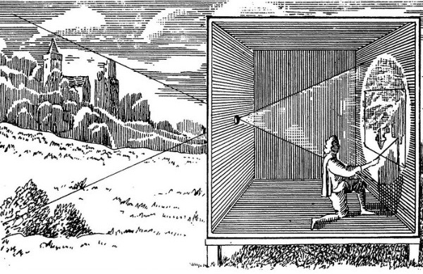
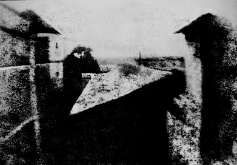

# La photographie
## Qu'est ce que c´est?
La photographie c'est savoir écrire avec la lumière.
## Un peu d'histoire
Le début de la photographie c´est avec la chambre noire.Une boite où il faut perser un petit trou pour voir apparaitre une image inverserdans le fond de la boite. 
## L'évolution des appareils photo
### Environ, en 400 avant Jésus Christ

Aristote a découvert que si l'on se place dans une pièce sombre avec juste le petit trou sur la porte et s'il fait très beau dehors, on peut voir sur le mur opposé à la porte l'image inversée du paysage extérieur. 
Quelques année après cette découverte,Hassan Ibn Hassan,en 1100 remarque que plus le trou qui laisse passer la lumière est petit, plus l’image est nette. 

### En 1515
Léonard de Vinci reprend les travaux de Hassan Ibn Hassan en créant ce qui est le début de l'appareil photographique : « camera obscura ». La chambre noire. instrument optique qui permet d'obtenir une vue en deux dimensions, proche de la vision humaine.

### En 1540
 Girolamo Cardano est un mathématicien, un inventeur, un astrologue et un médecin italien. Il remplace le sténopé (trou de faible dimension) par une lentille de verre. Le trou peut-être plus gros sans perdre la netteté de l'image.
### En 1553
  Giovanni Battista Della Porta est un physicien, un opticien, un philosophe et un alchimiste italien, Il ajoute un diaphragme à la « nouvelle camera obscura ».se qui permet de controlé la lumière qui rentre dans la camera.
### En 1650
Les peintres et les dessinateurs utilisent la camera obscura « moderne » et mettent la pression aux scientifiques pour obtenir des images plus précises. Ainsi, ils ont inventé les objectifs à plusieurs lentilles pour limiter les imperfections de l’image obtenue et modifier le point de vue grâce à des focales différentes.

### En 1673
Horke construit la « camera clara » avec un miroir et du verre dépoli, privé de son éclat. C’est pour ainsi dire le premier appareil (pas encore photographique) reflex. C’est un engin qui renvoie l’image sur un verre dépoli à l’aide d’un miroir incliné.
### En 1727
 La chimie intervient dans la création des images. Johann Heinrich Schulze, un savant allemand, découvre que l’iodure d’argent noircit à la lumière.
### En 1802, 
Thomas Wedgwood a travaillé avec Sir Humphry Davy, physicien et chimiste britannique. Ensemble, ils ont essayé de reproduire des tableaux et de faire « des portraits et des paysages » en utilisant la « camera obscura ». S’ils ont obtenu des résultats, ils n’ont jamais réussi à conserver l’image.
  
### De 1816 à 1818
Joseph Nicéphore Niépce, ingénieur français, dépose au fond de sa camera obscura une feuille de papier enduite de sels d’argent. Il obtient une vue du paysage extérieur pris depuis sa fenêtre, mais il était impossible d’arrêter le noircissement de la feuille. 
Ensuite, il essaye une nouvelle fois en utilisant non plus des substances qui noircissent à la lumière mais des substances que se décolorent à la lumière. Cette fois aussi, il n’est pas parvenu à stopper la réaction pour fixer l’image. Il découvre dans un traité de chimie que la résine de Gaïac jaune, extraite d’un résineux, devient verte sous l’action de la lumière et surtout qu’elle perd sa solubilité,, dans l’alcool. Il comprend grâce à cette propriété que l’on peut faire la différence entre la résine transformée et la résine intacte et donc fixer l’image. Malheureusement une fois sa feuille placée dans la camera obscura, il ne s’est rien passé. Il ne savait pas que ce n’était pas la lumière qui entraînait le changement mais une fraction de la lumière du jour qui était incapable de traverser les lentilles de sa camera obscura, le rayonnement UV.
### En 1822
Joseph Niépce grâce à une nouvelle résine d’origine minérale, le bitume de Judée, réussit à reproduire des dessins placés en contact avec des supports enduits de bitume et invente ainsi la photogravure.
### En 1824 
 Joseph Niépce place des pierres de calcaires recouvertes de bitume, au fond de la chambre obscure et obtient, pour la première fois, l’image fixée d’un paysage. Il faut poser plusieurs jours en plein soleil mais il s’agit d’une photographie ! La camera obscura se voit propulsée au rang d’appareil photographique.
 
### En 1828
Joseph Niépce découvre une nouvelle méthode qui produit des images d’une qualité supérieure mais il faut encore plusieur jours pour obtenir une image.
### En 1829 
Joseph Niépce s’associe avec Louis Daguerre, peintre français, dans l’espoir de raccourcir le temps de pose de son système. Il lui demande de lui construire une camera obscura donnant des images plus lumineuses. Ils ont mis au point une nouvelle méthode à base de résines d’arbres et le résidu de la distillation de la lavande. Le temps de pose est d’environ huit heures au soleil.
### En 1833
Joseph Niépce meurt et c’est son fils, Isidore Niépce qui prend sa suite dans la société qu’il a créé avec Louis Daguerre.
### En 1835
Louis Daguerre obtient des images avec un temps de pose beaucoup plus court. (chercher le temps)
### 1839 
Grâce aux daguerréotypes (invention de Louis Daguerre) l’appareil photographique devient populaire. Le temps de pose a énormément diminué, on est plus qu’à 20 minutes en plein soleil. Chaque daguerréotypes est unique et ne peut être reproduit. photo daguerréotypes
### En 1841
William Henry Fox Talbot, scientifique britannique créa le « calotype » qui est un vrai négatif (qui montre l'image avec les ton inverses ou les couleurs complémentaires de ceux du sujet photographié) qui permet de créer autant de positif que l’on veut (qui montre l’image avec les vraies couleurs du sujet photographié) à partir d’un seul négatif.
### En 1869
La première photographie en couleur par superposition de 3 négatifs (rouge vert et bleu ) par Louis Ducos de Hauron. 
### En 1880
George eastman à crée sa société "Kodak" Un camé dans une boite fermée qui permet de faire une serie de 100 photographie avec un film en rouleau souple. on  ne peut tout simplement pas faire de mise au point. Premier appareil pour monsieur madame tout le monde.il revoillais les appareil a l´usine pour qu´il puisse developper les photos.
### En 1906
La première vraie photographie en couleurs due à Auguste et Louis Lumière.
### En 1935
Il est possible de faire de la diapositive.
### En 1942
Le film négatif en couleurs.
### En 1948 
Début de la commercialisation du premier appareil à développement instantané.
### En 1975 
Naissance du premier appareil photographique numérique comme on le connait aujourd'hui.

 

   

## Comment c'est utilisé en multimédia
La photographie est utilisé dans beaucoup d´aspet du multimédia: au cinéma, en publicité, montage photo, pour le web aussi.
## Source 
http://www.ac-grenoble.fr/college/verney.sallanches/drupal/?q=system/files/histoire%20appareil%20photo_0.pdf
https://www.albertdemun.fr/art2mun/histoire-des-arts-4eme-la-physique-et-lart-la-camera-obscura/(image_chambre_noire_peintre)
https://artsandculture.google.com/exhibit/before-the-invention-of-photography/FQKC25AvuGDFLw(image_chambre_noire)
https://fr.wikipedia.org/wiki/Photographie_couleur(premiere_photographie_couleur)
https://fr.wikipedia.org/wiki/Histoire_de_la_photographie(premiere_photo)
